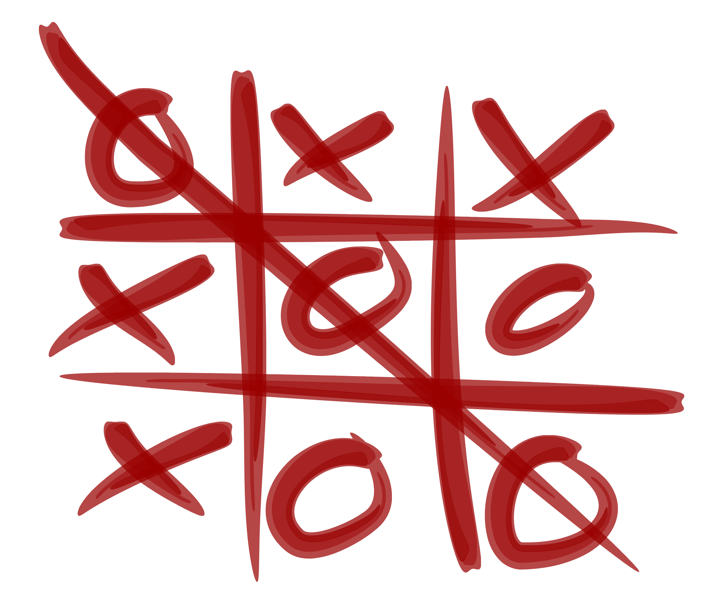
# Tic-Tac-Toe
This project is a Tic_Tac_Toe game with a client-server concept. The game has many features including playing with an 
AI with 2 different levels of difficulty and playing in multiplayer mode with online available players. the game also has a chatting feature that
allows players to communicate with each other during the game. Moreover, you can save your current game before it is finished and resume playing it
the next time both players are online as the game will prompt you to decide if you would like to continue playing or not.

        

- You can watch Demo video from [Demo](https://drive.google.com/file/d/1RwVjBn8hmnOxXWRp_0-tv_W6miEH5szR/view?usp=sharing)
## Installation
1. install mysql server on your pc from [here](https://dev.mysql.com/downloads/windows/installer/8.0.html)
2. use tic_tac.sql file included in the project and import it to mysql server
3. make a clone from the project on your pc
4. install and run intellij IDE to start using the game
5. the game includes 2 projects one for the client and the other for the server
6. locate the `database Info File.example.txt` in the server project and rename it as `database Info File.txt` and then change the values for 
username and pass fields to match those credentials you have on your mysql server 
- Rename command file for linix :`mv database Info File.example.txt database Info File.txt`.
7. add mysql jar file  
    - open project structure from file tab in toolbar or press `ctrl+Alt+shift+s` (intellij)
    - choose `Modules` then `Dependencies`.
    - press `+` choose `JARs or Directories`.
    - select mysql jar file from `jarFiles` directory included in the server project.
    - press `ok`.
8. run the ServerApp project to show the GUI for the server and start a connection, press the run button on server GUI to show all players
9. now you can navigate to client project and run the first client and don't forget to sign up as it is the first time to play
## How to play
1. sign in to the game with your username and password
2. choose to play in any mood offline or online through the invite button available next to usernames of currently ready players
3. in single mood you don't need to do anything just play with AI
4. in multiplayer mode you will send invitation to online player and wait for them to either accept your invitation and start a game or reject it
## SnapShots

    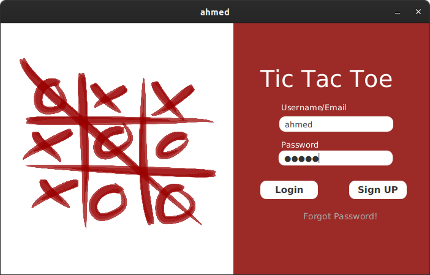
    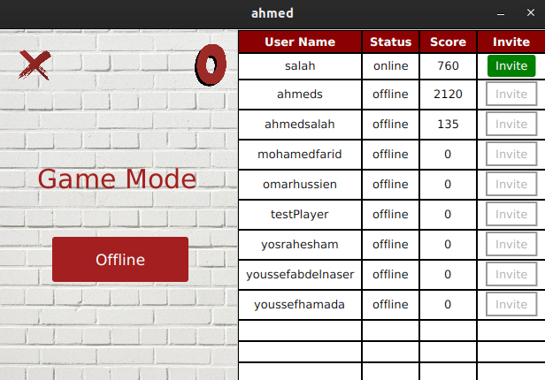
    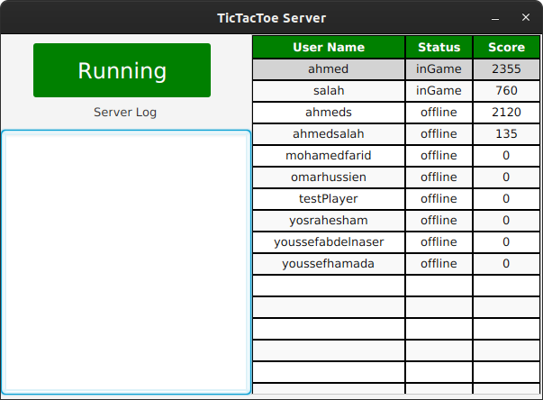

 

    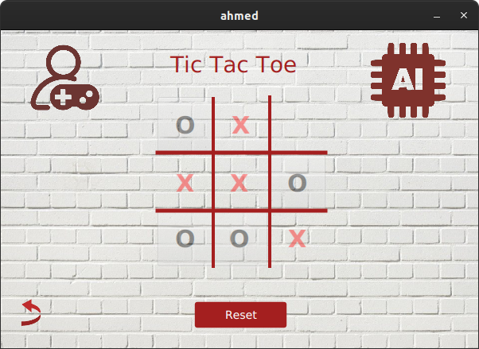 
    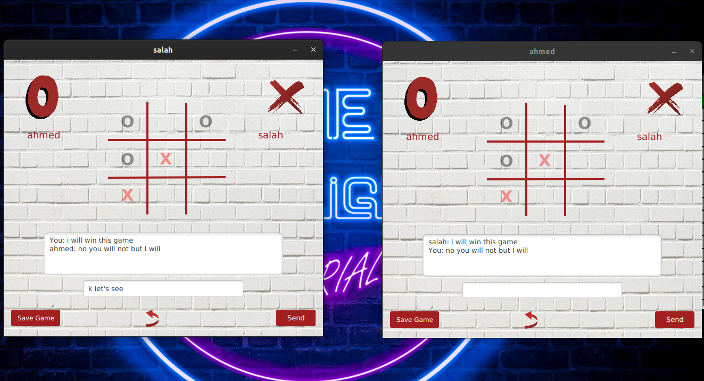
    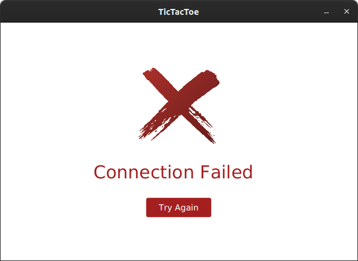

 

    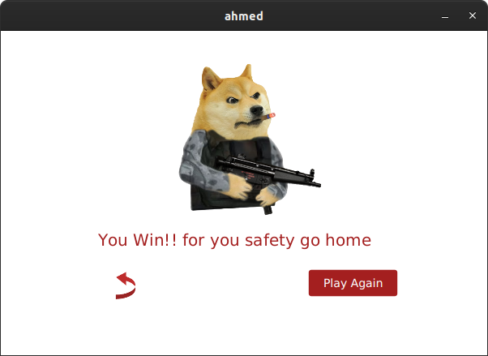 
    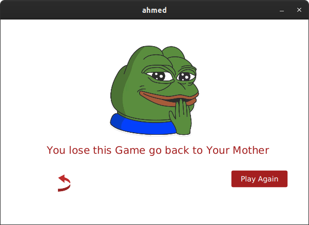
    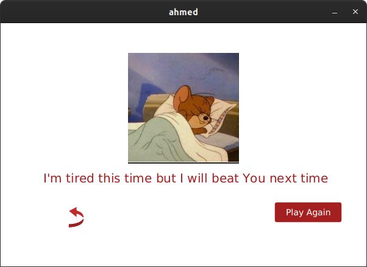

 

    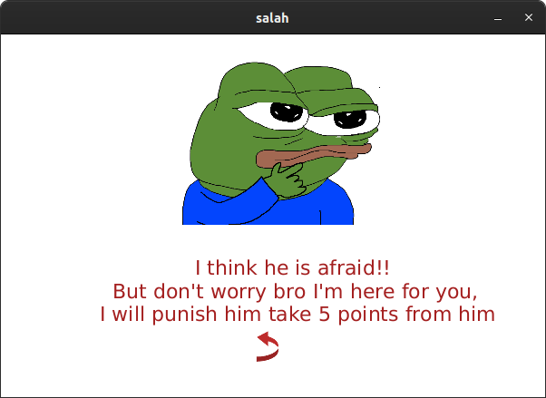
    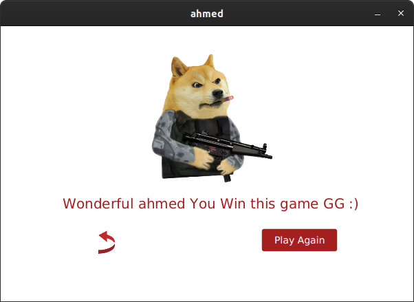 
    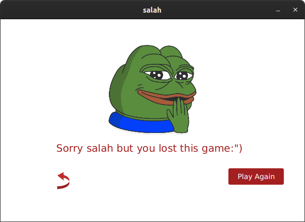

## Credits
- Ahmad Salah
- Mohamed Farid
- Omar Hussein 
- Yosra Hesham
- Youssef Abdelnasser
- Youssef Hamada
## License
- feel free to check out our project, play ... contribute .... have fun! :)
- Pull requests are welcome. For major changes, please open an issue first to discuss what you would like to change.

